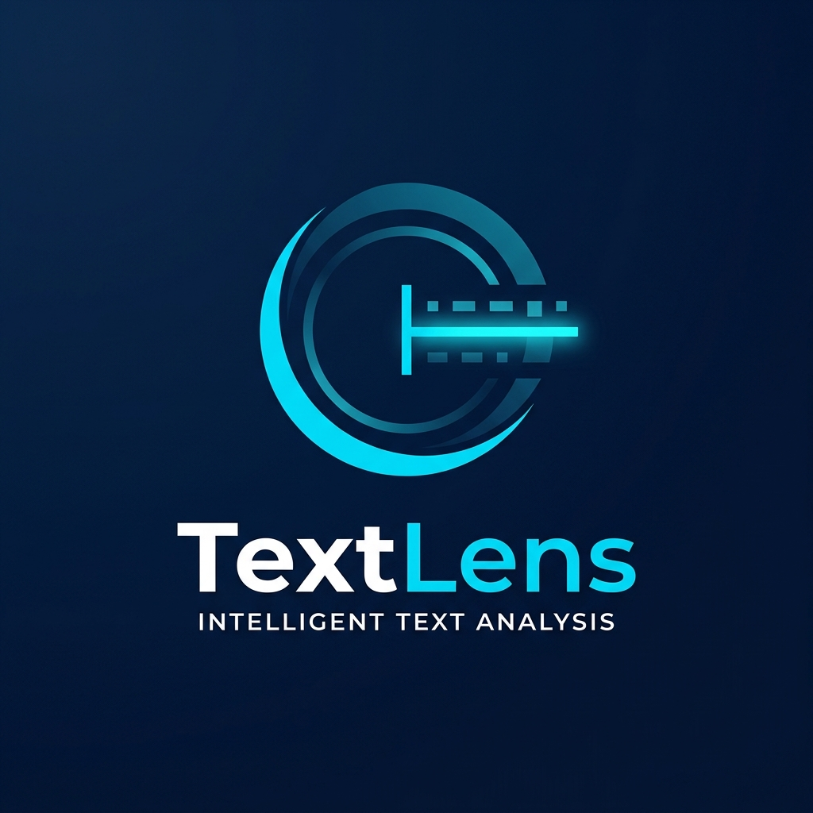
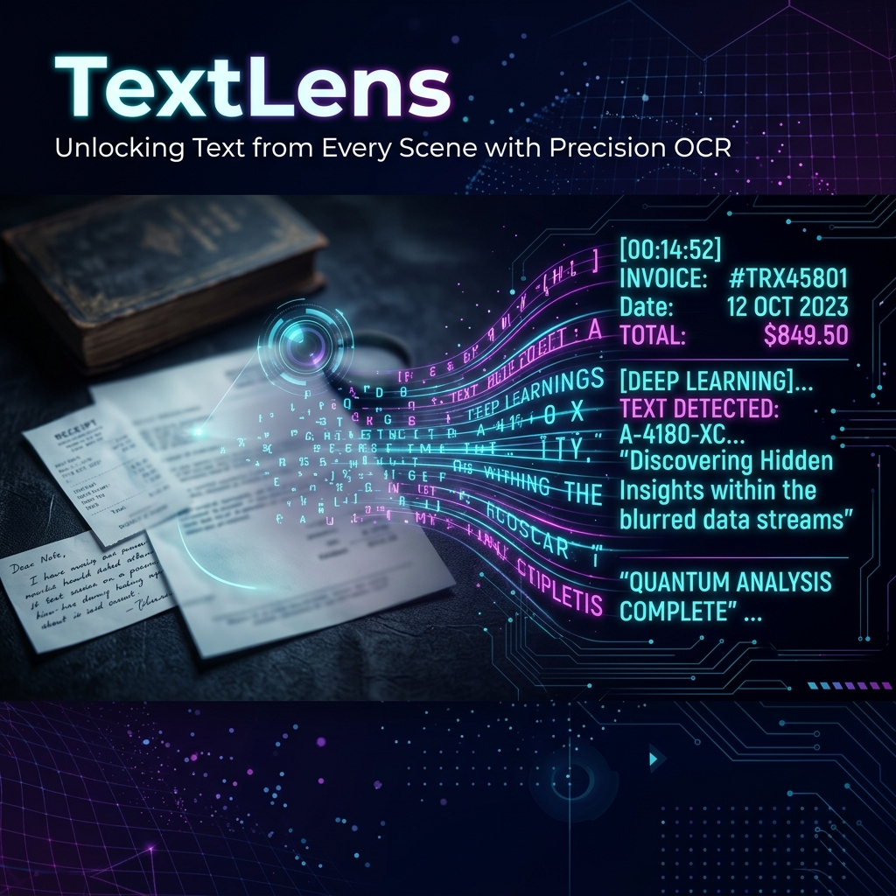

#  TextLens OCR



## 👁️ Overview
**TextLens** is a high-performance, minimalist OCR (Optical Character Recognition) platform designed for speed and precision. Whether you're extracting text from a handwritten note, a printed document, or a complex digital image, TextLens leverages industry-leading processing to deliver clean, accurate results in milliseconds.

Built with a modern tech stack focusing on responsiveness and visual excellence, TextLens provides a seamless bridge between visual media and editable text.

---

## ✨ Key Features
- **🚀 Ultra-Fast Extraction**: Leveraging optimized Tesseract.js workers for near-instant results.
- **🎨 Premium UI/UX**: A stunning, theme-aware interface built with React and Framer Motion.
- **🖼️ Image Optimization**: Backend processing with Sharp to ensure the highest OCR accuracy through intelligent resizing and filtering.
- **📱 Fully Responsive**: Seamless experience across mobile, tablet, and desktop devices.
- **🔒 Secure & Private**: Rate-limited API and secure file handling to protect your data.

---

## 🛠️ Tech Stack

### Frontend
- **Framework**: [React 19](https://react.dev/)
- **Build Tool**: [Vite 8](https://vitejs.dev/)
- **Styling**: [Tailwind CSS 4](https://tailwindcss.com/)
- **Animations**: [Framer Motion](https://www.framer.com/motion/)
- **Icons**: [Lucide React](https://lucide.dev/)

### Backend
- **Runtime**: [Node.js](https://nodejs.org/)
- **Framework**: [Express 5](https://expressjs.com/)
- **OCR Engine**: [Tesseract.js](https://tesseract.projectnaptha.com/)
- **Image Processing**: [Sharp](https://sharp.pixelplumbing.com/)
- **Middleware**: Multer, Helmet, CORS, Express Rate Limit

---

## 🚀 Getting Started

### Prerequisites
- Node.js (v18+)
- npm or yarn

### Installation

1. **Clone the repository**
   ```bash
   git clone https://github.com/Pranshu-Nigam/ImageToText.git
   cd ImageToText
   ```

2. **Backend Setup**
   ```bash
   cd backend
   npm install
   # Create a .env file based on .env.example (if available)
   npm run dev
   ```

3. **Frontend Setup**
   ```bash
   cd ../frontend
   npm install
   npm run dev
   ```

---

## 📖 Usage
1. Open the application in your browser (usually `http://localhost:5173`).
2. Drag and drop an image or click to upload.
3. Watch as **TextLens** processes the image in real-time.
4. Copy the extracted text to your clipboard with a single click!

---

## 🛡️ License
Distributed under the MIT License. See `LICENSE` for more information.

---

## 🤝 Contributing
Contributions are what make the open source community such an amazing place to learn, inspire, and create. Any contributions you make are **greatly appreciated**.

1. Fork the Project
2. Create your Feature Branch (`git checkout -b feature/AmazingFeature`)
3. Commit your Changes (`git commit -m 'Add some AmazingFeature'`)
4. Push to the Branch (`git push origin feature/AmazingFeature`)
5. Open a Pull Request

---

<p align="center">
  Developed with ❤️ by <a href="https://github.com/Pranshu-Nigam">Pranshu Nigam</a>
</p>
